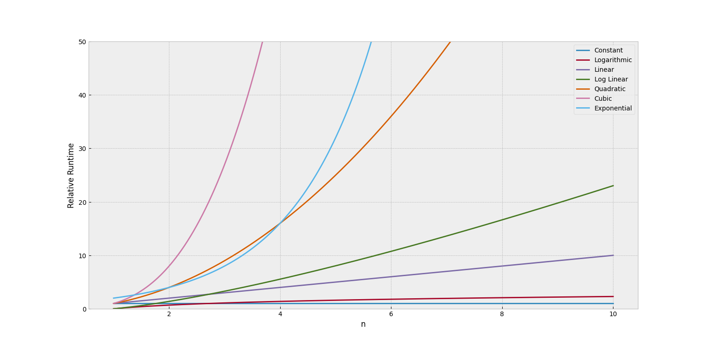

# algorithms-python
Algorithms and Data Structures in Python

## Big O Notation

| Big-O    | Name         |
|----------|--------------|
| 1        | Constant     |
| log(n)   | Logarithmic  |
| n        | Linear       |
| nlog(n)  | Log Linear   |
| n^2      | Quadratic    |
| n^3      | Cubic        |
| 2^n      | Exponential  |

## Big O Notation for Python Data Structures

https://wiki.python.org/moin/TimeComplexity

## Project Execution

### Run Tests
$ `pytest`

## Useful Links

https://www.bigocheatsheet.com/